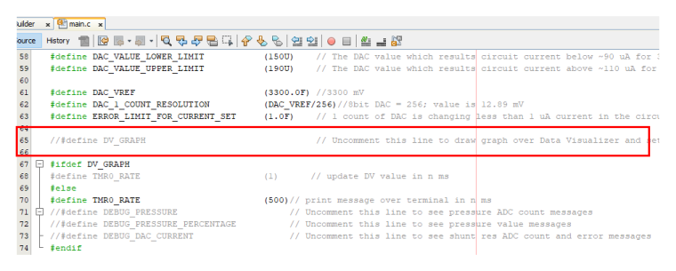

# Pressure Sensor interface with Differential output voltage using PIC16F17146 microcontroller

# Introduction
This code example demonstrates how to interface a pressure sensor with differential output voltage using differential ADCC and OPA of the PIC16F17146 microcontroller.

## Related Documentation
-	[PIC16F17146 Product Page](https://www.microchip.com/product/PIC16F17146)
-	[PIC16F17146 Data Sheet](https://www.microchip.com/DS40002343)
-	[PIC16F17146 Code Examples on GitHub](https://github.com/search?q=pic16f17146)

## Software Used
- MPLAB® X IDE [6.00 or newer](https://www.microchip.com/mplab/mplab-x-ide)
- Microchip XC8 Compiler [2.35 or newer](https://www.microchip.com/mplab/compilers)
- MPLAB® Code Configurator (MCC) [5.1.1 or newer](https://www.microchip.com/mplab/mplab-code-configurator)
-	Microchip PIC16F1xxxx Series Device Support (DFP) [1.13.178 or newer](https://packs.download.microchip.com/)

## Hardware Used
-	[PIC16F17146 Curiosity Nano Board](https://www.microchip.com/development-tool/EV72J15A)
-	[Curiosity Nano Base Board](https://www.microchip.com/development-tool/AC164162)
-	[Proto Click](https://www.mikroe.com/proto-click)
-	Resistors (15 KΩ, 820 KΩ) for Gain
-	Resistor (2 KΩ) for feedback current
-	[2SMPP-02 Pressure Sensor](https://www.onlinecomponents.com/en/omron-electronics/2smpp02-43415862.html?ref=searchads360feed&utm_term=2SMPP-02&&utm_source=bing&utm_medium=cpc&utm_campaign=6&utm_term=2smpp-02&utm_content=43415862&gclid=cedbf903aa9d14af5d1b9b7984e6381c&gclsrc=3p.ds)

## Sensor Overview
2SMPP-02 is a MEMS Gauge Pressure Sensor Featuring Small Size and Low Power Consumption. Its sensing method is Piezo-resistance and the pressure medium is air. A constant current is needed to driver this sensor.

Specifications:
- Pressure measurement range: 0 to 37 kPa
- Bridge resistance: 20 ±2 KΩ
- Offset voltage of -2.5±4 mV
- Span voltage of 31.0±3.1 mV
- Overall differential voltage output range: -2.4 to 31.0 mV
- Drive Current: 100 µA

**Pressure Sensor Internal circuit, Pins and kpa vs mV graph:**

**Pressure Sensor Working**

The 2SMPP-02 pressure sensor has a linear relationship between applied pressure and output in mV. A constant current of 100 µA (at Icc) is needed to drive the circuit and then the internal bridge circuit produces the correct output corresponding to applied pressure. The user needs to read Vout+ and Vout- using differential ADCC. As the difference in output is very small (in mV) then an amplifier is must before the signal is fed to differential ADCC.

## Implementation Details

Below is the implementation circuit overview block diagram using PIC16F17146:

DAC1 is an 8-bit buffered DAC that can be used to source pressure sensor which required a constant excitation current of 100 µA. Op-Amp can be used to amplify a differential signal.

**8-bit DAC and Shunt resistor Calculations:**

Pressure Sensor bridge resistance:

    ~20 KΩ.

Shunt Resistance used to measure circuit current:

    2 KΩ.

Total Circuit Resistance:

    ~22 KΩ.

So, the maximum DAC output voltage (as Bridge resistance decreases as pressure increases) when a 100 µA current is required is:

    22 KΩ * 100 µA = 2200 mV

Therefore, DAC reference voltage should be above 2.048 V. When VDD is 3.3 V, FVR with 4.096 V can not be used.

DAC Reference voltage is set to VDD:

    3.3 V

DAC step count can give output resolution of:

    3.3/256 = 0.01289 V or 12.89 mV

Therefore, DAC step count can vary current in the pressure sensor circuit:

    12.89 mV/22 KΩ = 0.586 uA;
which means circuit can be excited with good accuracy (less than 1 µA) using 8-Bit buffered DAC.

**12-bit Diff ADC and OPA gain calculations for Pressure measurement:**

OP-Amp gain:

    1+ (820K/15K) = ~ 55

Pressure extreme range as per datasheet:

	Max output:
        OPA Gain * Extreme Pressure Voltage mV = 55 * 37 = 2035 mV

    Resolution per mV:
        47 (kPa)/ 2035 (mV) = 0.023 (kPa/mV)

Typical Range:

    Max output at Op-Amp:
        55 * 31 mV = 1705 mV

Therefore, ADCC positive voltage reference can be set to 2.048 V and can be given by FVR.

**Pressure measurement calculations:**

    Sensor output (in mV) = 0.84 * Pressure applied (in kPa) – 2.25 [*** Linear equation from the sensor datasheet graph]

    =>Pressure applied (in kPa) = (2.25 + Sensor output (in mV))/0.84

    =>Pressure applied (in kPa) = 2.97 + Sensor output (in mV) * 1.19   ---------- Eq 1
But,

    Input signal given to ADCC = Sensor output (in mV) * OPA Gain

    =>Sensor output (in mV) = Input signal given to ADCC / OPA Gain

    =>Sensor output (in mV) = (ADCC Count * (ADCC Vref / ADC Max count)) / OPA Gain ------------ Eq 2
Hence, from Eq 1 and Eq 2,

    =>Pressure applied (in kPa) = 2.97 + ((ADCC Count * (ADCC Vref / ADC Max count)) / OPA Gain) * 1.19

    =>Pressure applied (in kPa) = ~3 + 0.0313 * (ADCC Count)

## Hardware Setup

## Hardware Connection
PIC16F17146 curiosity nano board is used as a development platform. The curiosity nano baseboard is used for connecting click boards to the curiosity nano board. Proto click is used as a general-purpose PCB to connect the 2SMPP-02 pressure sensor, gain resistors (820 KΩ, 15 KΩ), and shunt resistor (2 KΩ) to the PIC16F17146 microcontroller's peripherals. Proto click is placed in slot 3 of curiosity nano baseboard. Refer following sections for connection details.

**Hardware Modification**

PIC16F17146 CNANO has limited pins available for OPA input and DAC1 output. It is recommended to remove pull-up resistor soldered on CNANO baseboard near mikroBUS slot 1, SDA pin to work with this example firmware. This is needed as the RB4 pin is being used as OPA input and that pin is named "SDA" and has hardware pull-up on the CNANO baseboard. Please refer PIC16F17146 Curiosity Nano User Guide and Pin Connection Table section for more details.

*Note: User can able to use this example without any modification in hardware if configuring RA0 pin as DAC1OUT and RA2 as OPA input. In that case, the jumper wire should be re-connected as per proto click connections. Here it is required to mention that in Debugging mode, an example will not work properly as the RA0 pin is being used by the debugger which will interface DAC1OUT pin output and results in a hardware error message.*

**2SMPP-02 Pressure sensor and Proto click connection details:**

| Proto Click | Sensor Pin Name      | Function                    
| ---         | ------------         |-----------------------               
| INT         |  (1)Vout (+)         | Positive output of differential signal         
|             |  (2)Not Connected    | -----
| RST         |  (3)GND              | Analog Ground  
| SCK         |  (4)Vout (-)         | Negative output of differential signal     
|             |  (5)N-Sub            | Not-connected; but can be short to Sensor pin 6 (Icc)              
| MISO        |  (6)Icc              | Drive Current (100 µA)
| AN          |  820 K Res           | Connected OPA Output
| CS          |  820 K and 15 K Res  | Connected OPA inverting terminal

## Pin Connection Table

| PIC16F17146 Pin | Proto Click (Placed at Slot 3)    | Remarks
| --------------- | ------------------------------    | ----------------
| RA2	          | MISO (RC4)  *Connect using jumper  | DAC Output: Connected to the Icc pin of sensor to source 100 µA (Drive) current
| RA4	          | RST3  *Connect using jumper	      | Connected to Sensor GND and shunt resistor
| RB4	          | CS3  *Connect using jumper	      | Connected to the Inverting terminal of OPA and input gain resistor (15 KΩ)
| RC2	          | AN3 and RC7  *Connect using jumper | OPA output connected to the ADC pChannel and feedback resistor (820 KΩ)
| RC3	          | INT3  *Connect using jumper	      | Sensor Vout+ connected to the OPA non-inverting terminal
| RC6	          | SCK	                              | Sensor Vout- connected to the ADC nChannel

**Note 1: Connection from PIC16F17146 curiosity nano to click slot 3 is not available for all pins. Jumper cables are used to make the required connections. Use jumper cable where it is mentioned in Proto click column.*

## Demo Operation
The DAC1 adjusts the output voltage to maintain the constant current (100 µA) across the pressure sensor. The current feedback is taken by ADCC to adjust the DAC output. When the current is maintained at 100uA the pressure sensor output is read by ADCC by switching the ADCC channels. The Pressure reading is calculated and its percentage value is displayed on the terminal window using UART.

The microcontroller sends data to the PC with a baud rate of 9600 using UART with the help of the virtual serial port feature of the onboard debugger. To see the messages in a terminal window, connect the curiosity nano board to any terminal emulator. Data Visualizer which is available as a plugin to MPLAB X IDE can be used as a terminal emulator.

*Note: To see messages in a terminal window, the curiosity board needs to be connected to the terminal emulator. Data Visualizer which is available as a plugin to MPLAB X IDE can be used as a terminal emulator. Use Baud Rate of 9600.*

Also, the User can observe graphical data over the data visualizer by enabling a macro in main.c file of firmware and setting up variable streamer in data visualizer.

**Macro:**

DV_GRAPH

Below image shows data graph over data visualizer:

## Peripheral Configuration using MCC
This section explains how to configure the peripherals using MPLAB X IDE with the MCC plugin for the recreation of the project.

Refer [Software Used](https://github.com/microchip-pic-avr-examples/pic16f17146-pressure-sensor-interface-mplab-mcc#software-used) section to install required tools to recreate the project.

Additional Links: [MCC Melody Technical Reference](https://onlinedocs.microchip.com/v2/keyword-lookup?keyword=MCC.MELODY.INTRODUCTION&redirect=true)

##### Peripheral Configuration Summary
|**Module**	|**Configuration** | **Usage**
| --------- | ---------------- | -----------
|Clock Control	|Clock Source - HFINTOSC   HF Internal Clock - 1MHz   Clock Divider - 4	|System clock
|ADCC	|Enable ADC   Input Configuration- Differential Mode   Operating Mode – Burst Average   Result Alignment – Right justified   two’s compliment   Positive Reference – FVR (2.048 V)   Clock Source – FOSC   Clock Divide – FOSC/16   Threshold Interrupt Mode – Enabled   Repeat – 32   Accumulator Right Shift – 5 |Read Shunt resistor voltage and Pressure sensor output voltage
|DAC1	|Enable DAC   DAC Positive reference selection – VDD (3.3 V)   DAC Negative reference selection – VSS   DAC Output Enable Selection – DACOUT2 Enable and DACOUT1 Disable	|To provide 100 uA drive current for sensor
|OPA1	|Enable OPA   Op Amp Configuration – Direct Connection to Pins|
|FVR	|Enable FVR   FVR buffer 1 Gain (to ADC) – 2x (2.048 V)	|
|TMR0	|Enable Timer   Prescaler – 1:8   Timer Mode – 8 bit   Clock Source – FOSC/4   Request Period – 0.001 s   Enable Interrupt 	|1 ms interrupt to drive FSM scheduler
|EUSART1	|*UART1 Driver*   Requested Baudrate - 9600   UART PLIB Selector - EUSART1     *EUSART1 PLIB*   Enable Redirect STDIO to EUSART   Enable Receive   Enable Serial Port   Enable Transmit	|To send messages over terminal

##### Peripheral Configuration using MCC
###### Clock Control

###### FVR

###### ADCC

###### OPA1

###### DAC

###### TMR0

###### UART1 Driver

###### EUSART1 PLIB

*Note: The onboard debugger present on the curiosity nano board has a virtual serial port (CDC) that is connected to EUSART on the PIC16F17146 and provides an easy way to communicate with the target application through the terminal software. Refer curiosity nano board user guide for more details.*

###### Pins

###### Pin Grid View

## Summary
The example demonstrates the usage of DAC1, OPA, and 12- bit differential ADCC to read low-voltage differential signal from pressure sensor and display them over a terminal.
