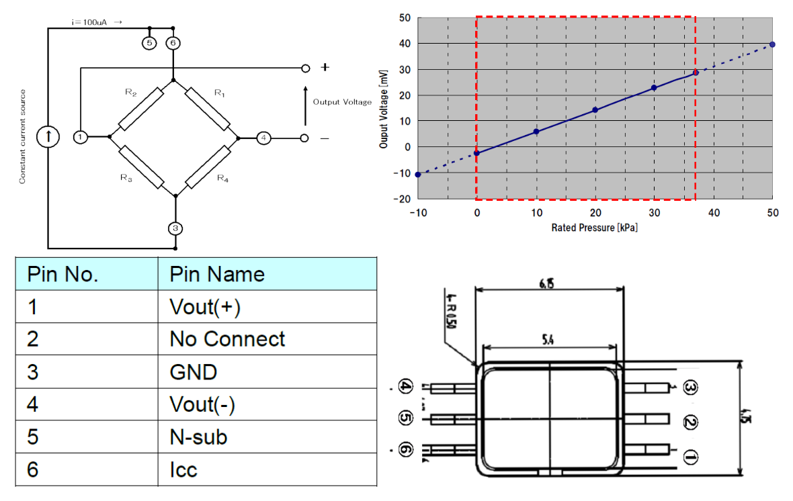

# Pressure Sensor Interface With Differential Output Voltage Using the PIC16F17146 Microcontroller

# Introduction
This code example demonstrates how to interface a pressure sensor with differential output voltage using differential Analog-to-Digital Converter With Computation (ADCC) and Operational Amplifier (OPA) of the PIC16F17146 microcontroller.

## Related Documentation
-	[PIC16F17146 Product Page](https://www.microchip.com/product/PIC16F17146)
-	[PIC16F17146 Data Sheet](https://www.microchip.com/DS40002343)
-	[PIC16F17146 Code Examples on GitHub](https://github.com/search?q=pic16f17146)

## Software Used
- [MPLAB® X IDE 6.15](https://www.microchip.com/mplab/mplab-x-ide) or newer
- [Microchip XC8 Compiler 2.45](https://www.microchip.com/mplab/compilers) or newer
- [MPLAB® Code Configurator (MCC) 5.3.7](https://www.microchip.com/mplab/mplab-code-configurator) or newer
- [MPLAB® Data Visualizer 1.3.1332](https://www.microchip.com/en-us/tools-resources/debug/mplab-data-visualizer) or newer
-	[Microchip PIC16F1xxxx Series Device Support (DFP) 1.22.376](https://packs.download.microchip.com/) or newer

## Hardware Used
-	[PIC16F17146 Curiosity Nano Board](https://www.microchip.com/development-tool/EV72J15A)
-	[Curiosity Nano Base Board](https://www.microchip.com/development-tool/AC164162)
-	[Proto Click](https://www.mikroe.com/proto-click)
-	Resistors (15 KΩ, 820 KΩ) for Gain
-	Resistor (2 KΩ) for feedback current
-	[2SMPP-02 Pressure Sensor](https://www.onlinecomponents.com/en/omron-electronics/2smpp02-43415862.html?ref=searchads360feed&utm_term=2SMPP-02&&utm_source=bing&utm_medium=cpc&utm_campaign=6&utm_term=2smpp-02&utm_content=43415862&gclid=cedbf903aa9d14af5d1b9b7984e6381c&gclsrc=3p.ds)

## Sensor Overview
2SMPP-02 is a MEMS Gauge Pressure Sensor Featuring Small Size and Low Power Consumption. Its sensing method is Piezo-resistance and the pressure medium is air. A constant current is needed to driver this sensor.

Specifications:
- Pressure measurement range: 0 to 37 kPa
- Bridge resistance: 20 ±2 KΩ
- Offset voltage of -2.5±4 mV
- Span voltage of 31.0±3.1 mV
- Overall differential voltage output range: -2.4 to 31.0 mV
- Drive Current: 100 µA

> Figure 1. Pressure Sensor Internal Circuit, Pins and kPa vs mV Graph

**Pressure Sensor Working**

The 2SMPP-02 pressure sensor has a linear relationship between applied pressure and output in mV. A constant current of 100 µA (at Icc) is needed to drive the circuit and then the internal bridge circuit produces the correct output corresponding to applied pressure. The user needs to read Vout+ and Vout- using differential ADCC. As the difference in output is very small (in mV) then an amplifier is must before the signal is fed to differential ADCC.

## Implementation Details

Below is the implementation circuit overview block diagram using PIC16F17146:

> Figure 2. Differential Pressure Sensor Interface Block Diagram

DAC1 is an 8-bit buffered Digital-to-Analog (DAC) that can be used to source pressure sensor which requires a constant excitation current of 100 µA. Op-Amp can be used to amplify a differential signal.

**8-bit DAC and Shunt Resistor  Calculations:**

    Pressure Sensor bridge resistance: ~20 KΩ.

    Shunt Resistance used to measure circuit current: 2 KΩ.

    Total Circuit Resistance: ~22 KΩ.

    So, the maximum DAC output voltage (as Bridge resistance decreases as pressure increases) when a 100 µA current is required is: 22 KΩ * 100 µA = 2200 mV

Therefore, the DAC reference voltage must be above 2.048V. When VDD is 3.3V, FVR with 4.096V can not be used.

    DAC Reference voltage is set to VDD: 3.3V

    DAC step count can give the output resolution of: 3.3/256 = 0.01289V or 12.89 mV

    Therefore, DAC step count can vary current in the pressure sensor circuit: 12.89 mV/22 KΩ = 0.586 uA;

which means circuit can be excited with good accuracy (less than 1 µA) using 8-Bit buffered DAC.

**12-bit Diff ADC and OPA Gain Calculations for Pressure Measurement:**

    OP-Amp gain: 1+ (820K/15K) = ~ 55

Pressure extreme range as per data sheet:

    Max output: OPA Gain * Extreme Pressure Voltage mV = 55 * 37 = 2035 mV

    Resolution per mV: 47 (kPa)/ 2035 (mV) = 0.023 (kPa/mV)

Typical Range:

    Max output at Op-Amp: 55 * 31 mV = 1705 mV

Therefore, ADCC positive voltage reference can be set to 2.048V and can be given by FVR.

**Pressure Measurement Calculations:**

    Sensor output (in mV) = 0.84 * Pressure applied (in kPa) – 2.25    [Linear equation from the sensor data sheet graph]

    Pressure applied (in kPa) = (2.25 + Sensor output (in mV))/0.84

    Pressure applied (in kPa) = 2.97 + Sensor output (in mV) * 1.19   ---------- Eq (1)
But,

    Input signal given to ADCC = Sensor output (in mV) * OPA Gain

    Sensor output (in mV) = Input signal given to ADCC / OPA Gain

    Sensor output (in mV) = (ADCC Count * (ADCC Vref / ADC Max count)) / OPA Gain ------------ Eq (2)

Hence, from Eq (1) and Eq (2),

    Pressure applied (in kPa) = 2.97 + ((ADCC Count * (ADCC Vref / ADC Max count)) / OPA Gain) * 1.19

    Pressure applied (in kPa) = ~3 + 0.0313 * (ADCC Count)

## Hardware Setup

> Figure 3. Hardware Setup

**Note:** Connection between RC7 and RC2 is not required anymore, as OPA output is connected to ADCC internally.

## Hardware Connection
PIC16F17146 curiosity nano board is used as a development platform. The curiosity nano baseboard is used for connecting click boards to the curiosity nano board. Proto click is used as a general-purpose PCB to connect the 2SMPP-02 pressure sensor, gain resistors (820 KΩ, 15 KΩ), and shunt resistor (2 KΩ) to the PIC16F17146 microcontroller's peripherals. Proto click is placed in slot 3 of curiosity nano baseboard. Refer following sections for connection details.

**Hardware Modification**

Pin RB4 is used as OPA inverting input. This pin is shared with SDA line of curiosity nano baseboard and it has hardware pull-up soldered by default. This resistor needs to be removed as shown in below diagram. Please refer to [PIC16F17146 Curiosity Nano board User Guide](https://www.microchip.com/DS50003388) for more details.

> Figure 4. Hardware Modification

**2SMPP-02 Pressure sensor and Proto click connection details:**

> Figure 5. Proto Click Circuit

| Proto Click | Sensor Pin Name      | Function                    
| ---         | ------------         |-----------------------               
| INT         |  (1)Vout (+)         | Positive output of differential signal         
|             |  (2)Not Connected    | --
| RST         |  (3)GND              | Ground  
| SCK         |  (4)Vout (-)         | Negative output of differential signal     
|             |  (5)N-Sub            | Not-connected; but can be short to Sensor pin 6 (Icc)              
| MISO        |  (6)Icc              | Drive Current (100 µA)
| AN          |  820 K Res           | Connected to OPA Output
| CS          |  820 K and 15 K Res  | Connected OPA inverting terminal

## Pins Table

| PIC16F17146 Pin | Function                                                   | Remarks
| --------------- | ----------------                                           | --------------------
| RA21            | DAC Output (sources 100 µA current)                        |
| RA41	          | Monitors sensor excitation current (ADCC positive channel) |                                       
| RB41	          | OPA inverting input                                        |
| RC21	          | OPA output                                                 | Connected to ADCC's positive channel internally
| RC31	        	| Sensor Vout+  (OPA non-inverting input)                    |
| RC6	            | Sensor Vout- (ADCC negative channel)                       |
| RB7	            | EUSART1 TX                                                 |
| RC1             | Curiosity Nano LED                                         |

**1Note:** Connections between PIC16F17146 Curiosity Nano board and Click™ Slot 3 are not available for these pins. Jumper cables are used to make the required connections. Connect RA4 to RST3, RB4 to CS3, RA2 to MISO, and RC3 to INT3.

## Demo Operation
The DAC1 adjusts the output voltage to maintain the constant current (100 µA) across the pressure sensor. The current feedback is taken by ADCC to adjust the DAC output. When the current is maintained at 100 uA the pressure sensor output is read by ADCC by switching the ADCC channels. The Pressure reading is calculated and its percentage value is displayed on the terminal window using UART.

The microcontroller sends data to the PC with a baud rate of 9600 using UART with the help of the virtual serial port feature of the onboard debugger. To see the messages in a terminal window, connect the curiosity nano board to any terminal emulator. Data Visualizer which is available as a plugin to MPLAB X IDE can be used as a terminal emulator.

> Figure 6. Terminal Messages

**Note:** To see messages in a terminal window, the Curiosity Nano board needs to be connected to the terminal emulator. Data Visualizer, which is available as a plugin to MPLAB X IDE, can be used as a terminal emulator. Use a baud rate of 9600.

Also, the user can observe graphical data in Data Visualizer by enabling a macro in the `main.c` file of the firmware and setting up a variable streamer in Data Visualizer.

**Macro:**

`DV_GRAPH`

> Figure 7. Macro for Data Visualizer Graph

The image below shows the data graph in Data Visualizer. Import the [data_streamer.ds](pic16f17146-pressure-sensor-interface-mplab-mcc.X/data_streamer.ds) file to configure Data Visualizer for this example. Refer to [MPLAB® Data Visualizer User's Guide](https://ww1.microchip.com/downloads/aemDocuments/documents/DEV/ProductDocuments/UserGuides/50003001.pdf) for more information.

> Figure 8. Data Visualizer Graph

## Peripheral Configuration Using MCC
This section explains how to configure the peripherals using MPLAB X IDE with the MCC plugin for the recreation of the project.

Refer to [Software Used](https://github.com/microchip-pic-avr-examples/pic16f17146-pressure-sensor-interface-mplab-mcc#software-used) section to install the required tools to recreate this project.

Additional Links: [MCC Melody Technical Reference](https://onlinedocs.microchip.com/v2/keyword-lookup?keyword=MCC.MELODY.INTRODUCTION&redirect=true)

##### Peripheral Configuration Summary
|**Module**	|**Configuration** | **Usage**
| --------- | ---------------- | -----------
|Clock Control	|Clock Source - HFINTOSC   HF Internal Clock - 4 MHz   Clock Divider - 1	|System clock
|ADCC	|Enable ADC   Input Configuration- Differential Mode   Operating Mode – Burst Average   Result Alignment – Right justified   two’s compliment   Positive Reference – FVR    Clock Source – FOSC   Clock Divide – FOSC/16    Threshold Interrupt Mode – Enabled   Repeat – 32   Accumulator Right Shift – 5 |Read Shunt resistor voltage and Pressure sensor output voltage
|DAC1	|Enable DAC   DAC Positive reference selection – VDD   DAC Negative reference selection – VSS   DAC Output Enable Selection – DACOUT2 Enabled and DACOUT1 Disabled	|To provide 100 uA drive current for sensor
|OPA1	|Enable OPA   Op Amp Configuration – Direct Connection to Pins    Positive Channel - OPA1IN+  Positive Source Selection - OPA1IN1+   Negative Channel - OPA1IN-   Negative Source Selection - OPA1IN0-|
|FVR	|Enable FVR   FVR buffer 1 Gain (to ADC) – 2x (2.048V)	|
|TMR0	|Enable Timer   Prescaler – 1:8   Postscaler - 1:1  Timer Mode – 8 bit   Clock Source – FOSC/4   Request Period – 0.001 s    Enable Interrupt 	|1 ms interrupt to drive FSM scheduler
|EUSART1	|*UART1 Driver*    UART PLIB Selector - EUSART1   Requested Baudrate - 9600   Enable Redirect STDIO to EUSART    *EUSART1 PLIB*    Disable Receive   Enable Serial Port   Enable Transmit	|To send messages over terminal
|Pin Settings	|*Pin Grid View*   ADCC   ANPx - RA4  ANNx - RC6   OPA1  OPA1INx+ : RC3   OPA1INx- : RB4    EUSART1   TX1 - RB7    DAC1   DCA1OUTx - RA2    *Pins*  RC1   Direction - Output  Custom Name - LED_D7    RA4   Custom Name - CurrentP      RC6   Custom Name - PressureN    RC3   Custom Name - OPA_P_IN    RB4   Custom Name - OPA_N_IN    RC2   Custom Name - OPA_OUT    RB7   Custom Name - UART_TX1     RA2   Custom Name - DCA1OUT    |

**Note:** The onboard debugger on the Curiosity Nano board has a virtual serial port (CDC) that is connected to EUSART on the PIC16F17146 and provides an easy way to communicate with the target application through the terminal software. Refer to the [Curiosity Nano board User Guide](https://www.microchip.com/DS50003388) for more details.

## Summary
The example demonstrates the usage of DAC1, OPA, and 12-bit differential ADCC to read low-voltage differential signal from pressure sensor and display them over a terminal.
